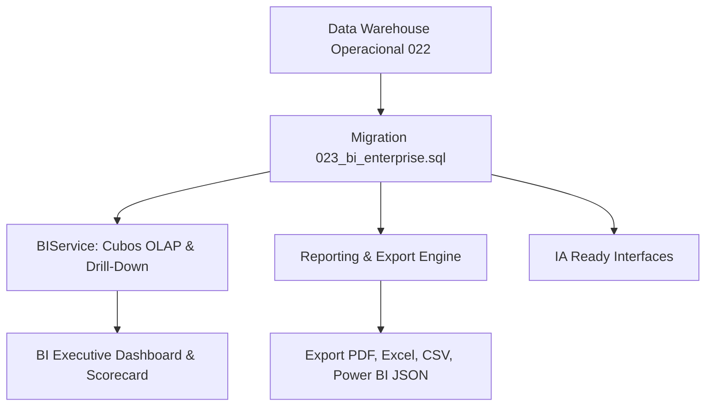

# 🧠 SOBRE MÍDIA ERP v2.0 — BUSINESS INTELLIGENCE ENTERPRISE (FASE 9.3)

**Fase:** FASE 9.3 — Business Intelligence (OLAP + Analytics + IA Ready)  
**Data:** 31 de Julho de 2026  
**Status:** **Homologado v2.0 Enterprise**

---

## 1. VISÃO GERAL DA ARQUITETURA BI

A camada de **Business Intelligence Enterprise (Fase 9.3)** estende o Data Warehouse Operacional (Fase 9.2) fornecendo cubos OLAP multidimensionais, suporte a drill-down hierárquico e uma arquitetura **IA Ready** preparada para modelos de machine learning na Fase 9.7.

---

## 2. ESTRUTURAS RELACIONAIS (`023_bi_enterprise.sql`)

1. **`public.bi_consultas`**: Rastreabilidade de consultas OLAP e tempos de execução.
2. **`public.bi_exportacoes`**: Log de arquivos gerados em formato PDF, Excel (XLSX), CSV e JSON do Power BI.
3. **`public.bi_agendamentos`**: Agendamentos para despacho automático de relatórios por e-mail e portal.
4. **`public.bi_alertas`**: Alertas inteligentes automatizados (queda de faturamento, SLA abaixo da meta, inadimplência).
5. **`public.bi_snapshots`**: Snapshots analíticos históricos com granularidade diária, mensal e anual.
6. **`public.bi_auditoria`**: Audit trail imutável de navegação e acessos BI.

---
*Documentação oficial do Módulo BI Enterprise do SOBRE MÍDIA ERP v2.0.*
