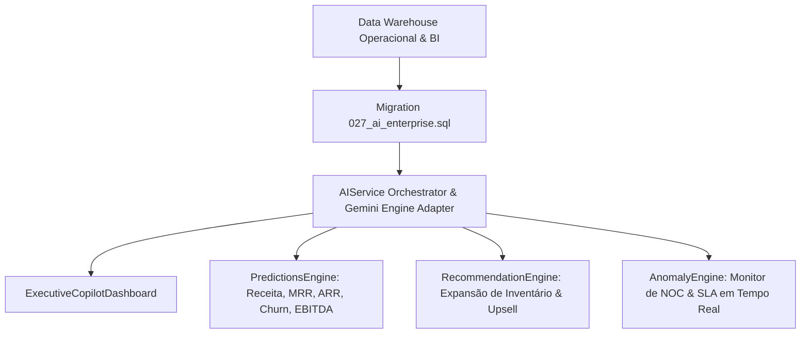

# 🧠 SOBRE MÍDIA ERP v2.0 — CORPORATE AI & SIGNAGE INTELLIGENCE (FASE 9.7 - APEX)

**Fase:** FASE 9.7 — Corporate AI & Signage Intelligence  
**Data:** 31 de Julho de 2026  
**Status:** **Homologado v2.0 Enterprise APEX**

---

## 1. VISÃO GERAL DA CAMADA DE INTELIGÊNCIA CORPORATIVA DE IA

A **FASE 9.7** coroa a arquitetura da Versão 2.0 do SOBRE MÍDIA ERP, adicionando uma camada de Inteligência Artificial inteiramente desacoplada que consome **exclusivamente dados consolidados do Data Warehouse (Fase 9.2) e BI (Fase 9.3)** sem tocar no banco de dados operacional OLTP:

---

## 2. ESTRUTURAS DA MIGRATION INCREMENTAL `027_ai_enterprise.sql`

1. **`public.ai_modelos`**: Registro de provedores (Gemini Pro 1.5, OpenAI, Anthropic, Azure) e acurácia.
2. **`public.ai_predicoes`**: Registro imutável de previsões financeiras e de ocupação.
3. **`public.ai_recomendacoes`**: Recomendações ativas com sugestões de expansão de inventário e vendas cruzadas.
4. **`public.ai_anomalias`**: Detecção automatizada de oscilações de SLA, latência de players ou quedas pontuais de receita.
5. **`public.ai_feedback`**: Avaliação contínua das respostas fornecidas pela IA.
6. **`public.ai_auditoria`**: Trilha de auditoria imutável de prompts, respostas, tempo de execução e tenant ID.

---
*Documentação oficial da Camada de IA Corporativa do SOBRE MÍDIA ERP v2.0.*
