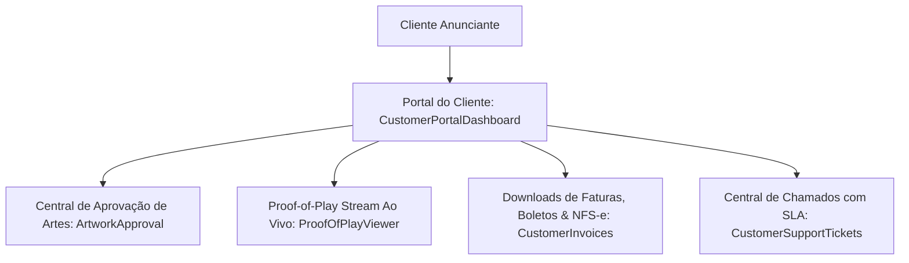

# 👤 SOBRE MÍDIA ERP v2.0 — PORTAL DO CLIENTE ANUNCIANTE ENTERPRISE (FASE 9.5)

**Fase:** FASE 9.5 — Portal do Cliente Enterprise (Self-Service)  
**Data:** 31 de Julho de 2026  
**Status:** **Homologado v2.0 Enterprise**

---

## 1. VISÃO GERAL DO PORTAL DE AUTOATENDIMENTO DO CLIENTE

O **Portal do Cliente (Fase 9.5)** fornece um ambiente de autoatendimento completo e seguro para anunciantes acompanharem suas campanhas de mídia OOH / DOOH:

---

## 2. ESTRUTURAS DA MIGRATION INCREMENTAL `025_customer_portal.sql`

1. **`public.portal_usuarios`**: Cadastro de acessos de clientes com status, e-mail e hash de senha.
2. **`public.portal_sessoes`**: Registro de logins, IPs, user agent e dispositivo.
3. **`public.portal_notificacoes`**: Central de notificações ativas por cliente.
4. **`public.portal_downloads`**: Trilha de downloads efetuados (boletos, contratos, NFs, relatórios POP).
5. **`public.portal_chamados`**: Central de chamados de atendimento com controle de SLA.
6. **`public.portal_aprovacoes`**: Histórico de aprovação/rejeição de criativos.
7. **`public.portal_auditoria`**: Rastreabilidade imutável de ações no portal.

---
*Documentação oficial do Portal do Cliente do SOBRE MÍDIA ERP v2.0.*
