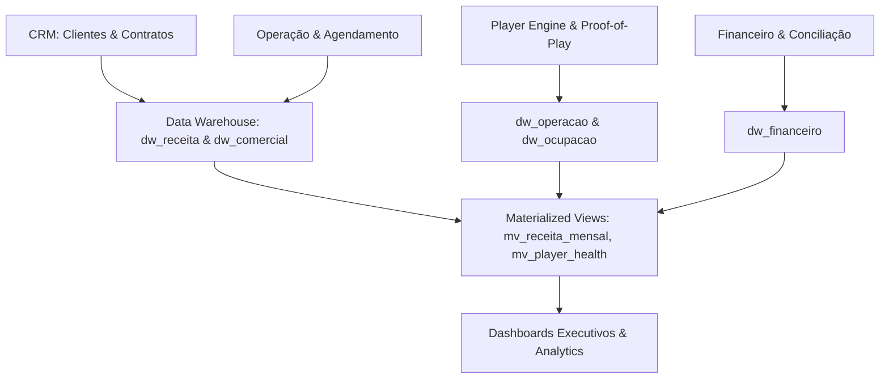

# 📊 SOBRE MÍDIA ERP v2.0 — ARQUITETURA DE DATA WAREHOUSE (FASE 9.2)

**Fase:** FASE 9.2 — Data Warehouse Operacional & Dashboards Executivos  
**Data:** 31 de Julho de 2026  
**Status:** **Homologado v2.0 Enterprise**

---

## 1. VISÃO GERAL DO DATA WAREHOUSE (DW)

O Data Warehouse Operacional do SOBRE MÍDIA ERP v2.0 foi desenhado como uma camada analítica de leitura isolada por tenant (`empresa_operadora_id`), agregando continuamente dados de CRM, Operação, NOC, Player Engine e Financeiro.

---

## 2. TABELAS DO DATA WAREHOUSE (`022_datawarehouse.sql`)

1. **`public.dw_receita`**: Agregação diária de receitas previstas vs. realizadas por cidade, estado, unidade, painel e cliente.
2. **`public.dw_operacao`**: Consolidação de campanhas ativas/finalizadas, tempo total de exibição, Proof-of-Play, Uptime, SLA e leituras de Heartbeat.
3. **`public.dw_financeiro`**: Métricas de receita bruta/líquida, taxa de inadimplência, recebimentos, saldos e comissões.
4. **`public.dw_ocupacao`**: Análise percentual de capacidade ocupada da rede de painéis vs. tempo livre comercializável.
5. **`public.dw_comercial`**: KPIs de Vendas e SaaS (Taxa de Conversão, CAC, LTV, Churn, Retenção e Ticket Médio).
6. **`public.analytics_auditoria`**: Rastreabilidade imutável de atualizações de views, exportações (PDF/Excel/CSV) e consultas.

---
*Documentação oficial do Data Warehouse do SOBRE MÍDIA ERP v2.0.*
