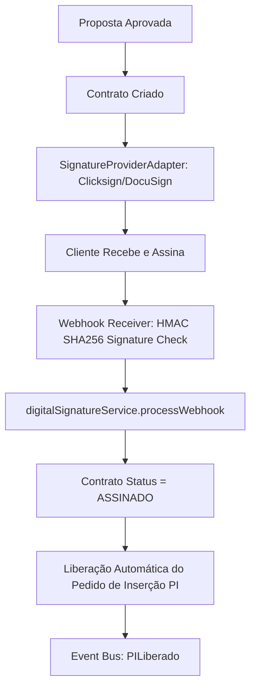

# ✍️ SOBRE MÍDIA ERP v2.0 — ASSINATURA DIGITAL ENTERPRISE (FASE 9.4)

**Fase:** FASE 9.4 — Assinatura Digital Enterprise  
**Data:** 31 de Julho de 2026  
**Status:** **Homologado v2.0 Enterprise**

---

## 1. VISÃO GERAL DO FLUXO DE ASSINATURA DIGITAL AUTOMATIZADA

O módulo de **Assinatura Digital Enterprise (Fase 9.4)** automatiza completamente a transição entre o contrato homologado e a liberação operacional da campanha no Pedido de Inserção (PI):

---

## 2. ESTRUTURAS DA MIGRATION INCREMENTAL `024_digital_signature.sql`

1. **`public.assinaturas`**: Controle de envelopes com `provedor`, `status`, `envelope_id`, `document_hash`, `assinado_em`, `expira_em`, `pdf_original_key`, `pdf_assinado_key`.
2. **`public.assinatura_eventos`**: Histórico atômico de eventos (`ENVIADO`, `VISUALIZADO`, `ASSINADO`, `RECUSADO`, `EXPIRADO`, `CANCELADO`, `WEBHOOK_RECEBIDO`, `VALIDADO`).
3. **`public.assinatura_auditoria`**: Rastreabilidade imutável com IP, User-Agent, timestamp e tenant ID.

---
*Documentação oficial da Assinatura Digital do SOBRE MÍDIA ERP v2.0.*
