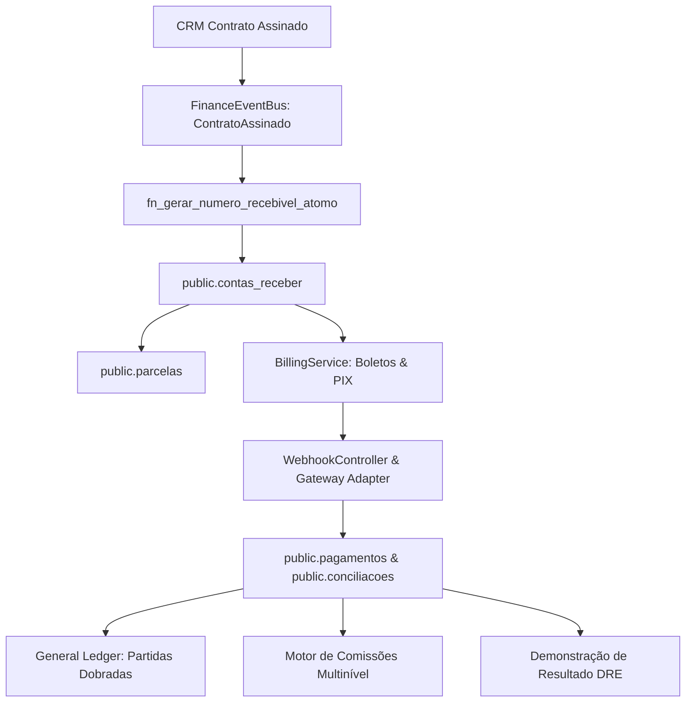

# 💳 SOBRE MÍDIA ERP v2.0 — ARQUITETURA E DOCUMENTAÇÃO TÉCNICA FINANCEIRA ENTERPRISE

**Módulo:** Financeiro Enterprise Completo (Fase 9.1-B)  
**Data da Documentação:** 31 de Julho de 2026  
**Status da Versão:** **Homologado v2.0 Enterprise**

---

## 1. VISÃO GERAL DA ARQUITETURA FINANCEIRA

O **Módulo Financeiro Enterprise** opera como um domínio desacoplado e orientado a eventos no SOBRE MÍDIA ERP v2.0.



---

## 2. REGRAS DA RÉGUA DE COBRANÇA AUTOMÁTICA

| Marco Temporal | Canal Notificação | Ação Automática no Sistema |
| :--- | :--- | :--- |
| **5 Dias Antes** | E-mail / Push | Envio de lembrete com chave PIX e Boleto para download. |
| **3 Dias Antes** | WhatsApp | Notificação prévia de vencimento. |
| **Vencimento** | E-mail / WhatsApp | Alerta de vencimento no dia. |
| **5 Dias Atraso** | WhatsApp | Reenvio de segunda via com atualização de juros e multa. |
| **15 Dias Atraso** | E-mail | Notificação formal de status Inadimplente. |
| **30 Dias Atraso** | Sistema | Bloqueio comercial automatizado de novos PIs/campanhas. |
| **60 Dias Atraso** | Sistema | Encaminhamento para cobrança jurídica externa. |

---

## 3. ADAPTADORES DE GATEWAY FINANCEIRO & WEBHOOKS

O sistema possui uma interface genérica `FinanceGatewayAdapter` homologada para:
- **Banco do Brasil, Bradesco, Santander, Itaú, Sicoob**: Emissão de boletos registrados.
- **Asaas & Gerencianet/Efí**: Cobrança via PIX dinâmico com webhooks de liquidação instantânea.
- **Stripe & Mercado Pago**: Transações de cartão de crédito e recorrência.

---

## 4. DEMONSTRAÇÃO DO RESULTADO DO EXERCÍCIO (DRE)

A apuração de resultados gerenciais no `DREService` segue a estrutura contábil corporativa:

```
  (+) RECEITA BRUTA DE VENDAS (Mídias Signage)
  (-) Descontos Concedidos
  (=) RECEITA LÍQUIDA DE VENDAS
  (-) Custos Operacionais NOC & Transmissão (35%)
  (=) MARGEM BRUTA DE LUCRO
  (-) Despesas Administrativas & Vendas (15%)
  (=) RESULTADO LÍQUIDO DO EXERCÍCIO (EBITDA)
```

---
*Documentação oficial do Módulo Financeiro Enterprise do SOBRE MÍDIA ERP v2.0.*
