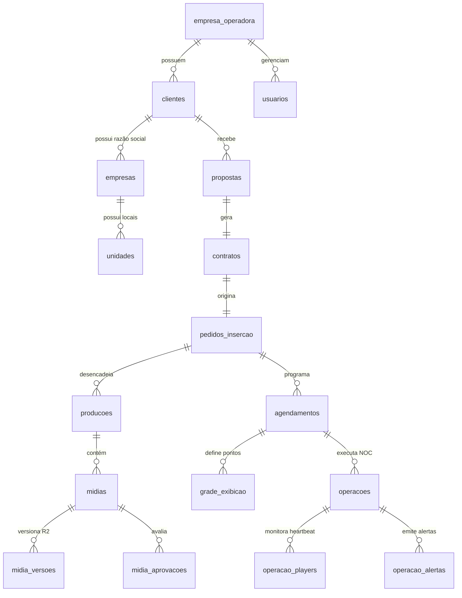

# 📘 SOBRE MÍDIA ERP — CATÁLOGO TÉCNICO & DICIONÁRIO DE DADOS (FASE 8.0-E)

**Documento:** Governança de Dados, Arquitetura Relacional & Dicionário Completo  
**Versão da Arquitetura:** 8.0-E (Consolidação Master)  
**Data:** 31 de Julho de 2026  
**Autor:** Arquiteto de Dados & Engenheiro Principal do SOBRE MÍDIA ERP  

---

## 1. VISÃO GERAL & DIRETRIAES DE ARQUITETURA

O **SOBRE MÍDIA ERP** é uma plataforma multi-tenant isolada construída sobre o PostgreSQL com as seguintes premissas invioláveis:
1. **Isolamento Multi-Tenant**: Toda tabela operacional possui obrigatoriamente `empresa_operadora_id UUID`.
2. **Concorrência Atômica**: Serialização de códigos (`codigo_cliente`, `numero_contrato`, `numero_pi`) via `pg_advisory_xact_lock` por tenant.
3. **Imutabilidade Jurídica**: Contratos e snapshots de propostas mantêm versão imutável no banco e artefatos HTML/PDF no Cloudflare R2.
4. **Resiliência de Mídia**: Armazenamento exclusivo no Cloudflare R2 sob a estrutura `tenants/{tenant_id}/...`.

---

## 2. DIAGRAMA ER (ENTITY-RELATIONSHIP) EM MERMAID

---

## 3. DICIONÁRIO COMPLETO DAS 18 TABELAS (`001–018`)

### 3.1. Core & Autenticação (`001–002`)
- **`public.empresa_operadora`**: Cadastro da empresa franqueadora/matriz dona do tenant.
  - `id` (UUID PK), `razao_social`, `nome_fantasia`, `cnpj`, `created_at`.
- **`public.usuarios`**: Usuários do sistema vinculados ao Supabase Auth.
  - `id` (UUID PK = auth.users.id), `empresa_operadora_id` (FK), `nome`, `email`, `role` (`ADMIN`, `REPRESENTANTE`, `OPERADOR`, `DESIGNER`), `aprovado` (BOOLEAN).

### 3.2. Módulo Comercial CRM (`003, 010, 011`)
- **`public.clientes`**: Cadastro unificado de clientes.
  - `id` (UUID PK), `empresa_operadora_id` (FK), `codigo_cliente` (VARCHAR 20 UNIQUE por tenant, ex: `CLI-000001`), `status`, `created_at`.
- **`public.empresas`**: Dados jurídicos (CNPJ/Razão Social) do cliente.
  - `id` (UUID PK), `cliente_id` (FK), `razao_social`, `nome_fantasia`, `cnpj`, `inscricao_estadual`, `logradouro`, `cidade`, `estado`.
- **`public.unidades`**: Pontos físicos do cliente.
  - `id` (UUID PK), `empresa_id` (FK), `nome`, `tipo` (`MATRIZ`, `FILIAL`), `endereco`.
- **`public.contatos`**: Pessoas de contato.
  - `id` (UUID PK), `empresa_id` (FK), `nome`, `cargo`, `email`, `telefone`.

### 3.3. Propostas & Contratos (`004, 012, 013`)
- **`public.propostas`**: Orçamentos comerciais aprovados.
  - `id` (UUID PK), `empresa_operadora_id` (FK), `cliente_id` (FK), `numero_proposta` (ex: `PROP-2026-0001`), `valor_final`, `forma_pagamento`, `status`.
- **`public.contratos`**: Documentos contratuais atrelados às propostas.
  - `id` (UUID PK), `proposta_id` (FK), `numero_contrato` (ex: `CTR-2026-0001`), `tipo_contrato` (`ANUNCIANTE`, `PARCEIRO`), `pdf_object_key`, `status_documento`.
- **`public.contrato_templates`**: Templates jurídicos imutáveis.
  - `id` (UUID PK), `tipo_contrato`, `nome`, `conteudo_html`, `versao`.

### 3.4. Pedidos de Inserção (PI) (`014`)
- **`public.pedidos_insercao`**: Entidade coordenadora da operação.
  - `id` (UUID PK), `empresa_operadora_id` (FK), `cliente_id` (FK), `contrato_id` (FK), `numero_pi` (ex: `PI-2026-0001`), `status`, `prioridade`, `inicio_veiculacao`, `fim_veiculacao`, `quantidade_pecas`, `pdf_object_key`.
- **`public.pi_locais`**: Locais/telas mapeados para o PI.
- **`public.pi_historico`**: Histórico auditado de transições do PI.
- **`public.pi_auditoria`**: Log de auditoria exclusivo do PI.

### 3.5. Produção de Mídias (`015`)
- **`public.producoes`**: Módulo de produção de artes/vídeos.
  - `id` (UUID PK), `pedido_insercao_id` (FK), `titulo`, `status` (`CRIADA` até `PUBLICADA`), `prioridade`, `prazo`.
- **`public.midias`**: Arquivos de mídia cadastrados.
  - `id` (UUID PK), `producao_id` (FK), `tipo` (`Imagem`, `Vídeo`, `HTML5`, `ZIP`, `PDF`), `nome`, `object_key` (`tenants/{tenant}/...`), `checksum`, `versao_atual`, `status`.
- **`public.midia_versoes`**: Versionamento imutável no R2 Storage.
- **`public.midia_aprovacoes`**: Pareceres formais de aprovação/reprovação técnica.

### 3.6. Agendamento da Rede (`016`)
- **`public.agendamentos`**: Programação da rede de exibição.
  - `id` (UUID PK), `pedido_insercao_id` (FK), `titulo`, `status` (`RASCUNHO` até `ENCERRADO`), `inicio`, `fim`, `timezone`.
- **`public.grade_exibicao`**: Detalhes da grade por ponto.
  - `id` (UUID PK), `agendamento_id` (FK), `unidade_id`, `tela_id`, `player_id`, `playlist_id`, `hora_inicio`, `hora_fim`, `quantidade_insercoes`.

### 3.7. Centro Operacional NOC (`017`)
- **`public.operacoes`**: Execução live da campanha.
  - `id` (UUID PK), `agendamento_id` (FK), `status`, `health_status` (`HEALTHY`, `WARNING`, `CRITICAL`), `ultima_sincronizacao`, `ultima_exibicao`.
- **`public.operacao_players`**: Heartbeat e conectividade dos players.
- **`public.operacao_logs`**: Logs estruturados de sincronização e download.
- **`public.operacao_metricas`**: KPIs de exibições, SLA, uptime e tempo de tela.
- **`public.operacao_alertas`**: Central de alertas em tempo real.

---

## 4. CATALOGO DE RPCs & FUNÇÕES PL/pgSQL

1. **`fn_gerar_codigo_cliente_atomo(p_tenant_id, p_prefixo)`**: Gera `codigo_cliente` atômico via `pg_advisory_xact_lock`.
2. **`fn_gerar_numero_contrato_atomo(p_tenant_id)`**: Gera `numero_contrato` sequencial sem colisão por tenant.
3. **`fn_gerar_numero_pi(p_tenant_id)`**: Gera `numero_pi` sequencial (`PI-2026-0001`).
4. **`fn_validar_conflitos_agendamento(...)`**: Detecta choque de horários (`OVERLAPS`) entre agendamentos na mesma tela/player.
5. **`get_user_empresa_operadora_id(p_user_id)`**: Resolve o tenant do usuário logado para as políticas RLS.

---

## 5. INVENTÁRIO DE INTEGRAÇÕES EXTERNAS

- **Cloudflare R2 Storage**: Armazenamento privado de PDFs e vídeos sob `tenants/{tenant_id}/...`.
- **Resend Email API**: Envio transacional de notificações e PDFs de propostas.
- **Supabase Auth**: Autenticação via JWT com suporte a metadata `aprovado`.
- **Player Web Worker Engine**: Runtime do player no navegador com temporizador isolado via Web Worker Blob.
