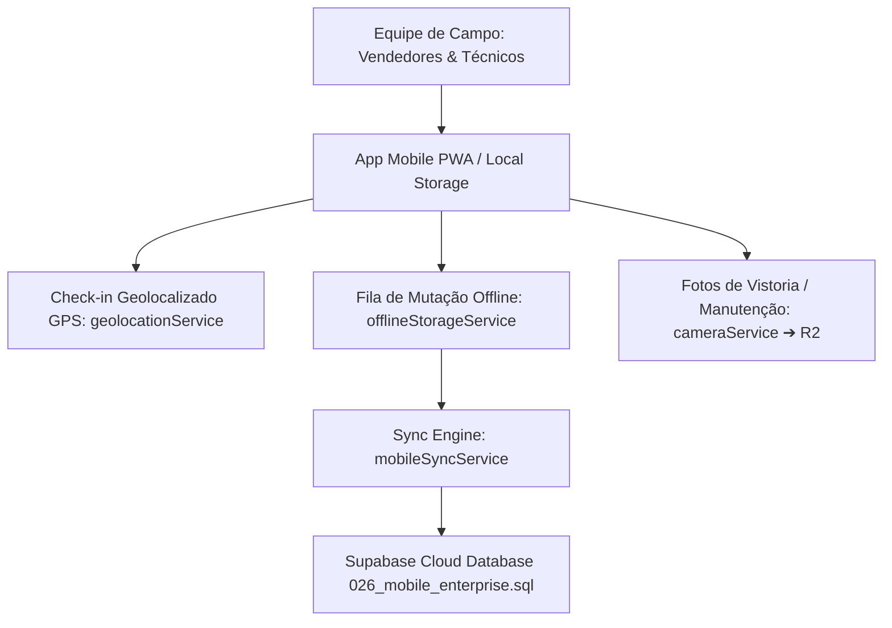

# 📱 SOBRE MÍDIA ERP v2.0 — MOBILE ENTERPRISE & PWA (FASE 9.6)

**Fase:** FASE 9.6 — Mobile Enterprise (Field Sales & Field Operations)  
**Data:** 31 de Julho de 2026  
**Status:** **Homologado v2.0 Enterprise**

---

## 1. VISÃO GERAL DO APLICATIVO CORPORATIVO DE CAMPO

O **Mobile Enterprise (Fase 9.6)** provê uma experiência de uso offline-first para equipes de vendas (Field Sales) e equipes técnicas de manutenção/instalação de campo (Field Operations):

---

## 2. ESTRUTURAS DA MIGRATION INCREMENTAL `026_mobile_enterprise.sql`

1. **`public.mobile_dispositivos`**: Registro de aparelhos com suporte a Push Notification tokens.
2. **`public.mobile_sincronizacao`**: Log de auditoria de sincronizações offline com delta sync.
3. **`public.mobile_checkins`**: Histórico de coordenadas GPS (latitude, longitude, precisão).
4. **`public.mobile_visitas`**: Registro de visitas comerciais e técnicas.
5. **`public.mobile_fotos`**: Fotos gravadas no Cloudflare R2 com marca d'água geolocalizada.
6. **`public.mobile_rotas`**: Rastreamento de rotas executadas.
7. **`public.mobile_auditoria`**: Log imutável de eventos mobile.

---
*Documentação oficial do App Mobile Enterprise do SOBRE MÍDIA ERP v2.0.*
